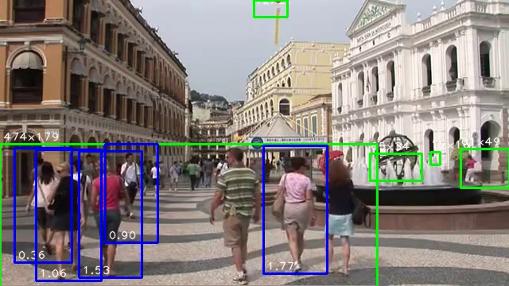

If you are interested in compiling the latest version of OpenCV for the [CHIP](https://getchip.com/pages/chip) SBC then this project will show you how. You should be experienced with [flashing](https://docs.getchip.com/chip.html#flash-chip-with-an-os) your CHIP and formatting a USB flash drive as ext4. It also does not hurt to know Linux, Python and OpenCV as well. I have created a set of scripts that automate the install process.

My [Install OpenCV](https://github.com/sgjava/install-opencv) supports x86, x86_64, ARMV7 and ARMV8 on Ubuntu 16.04, Debian GNU/Linux 8 (jessie) and probably other distributions. I will keep CHIP specific items here so as not to pollute the Install OpenCV project. Just change the config.sh options for the CHIP as needed before running install.sh.

This is intended for a headless server, but you can modify install-opencv.sh to use a GUI. You can see where I built OpenCV using QT [here](https://bbs.nextthing.co/t/opencv-3-2-using-hdmi-dip-for-face-detection-gui/13432). I used the HDMI DIP for the display.

If you want to make your own CHG-IN cables click [here](https://bbs.nextthing.co/t/powering-chip-off-chg-in-using-cheap-cables/14469).

Below are examples of resolutions and frame rates based on detection type: 

Motion detection (MJPEG camera and XVID encoding)

| Resolution | Record FPS | Sample FPS |
|------------|:----------:|-----------:|
|   1280x720 |          5 |        2.5 |
|    800x448 |         10 |        3.1 |
|    640x480 |         15 |        3.1 |

Pedestrian detection (MJPEG camera and XVID encoding)

| Resolution | Record FPS | Sample FPS |
|------------|:----------:|-----------:|
|    800x448 |          5 |        2.5 |
|    640x480 |         10 |        3.1 |
|    320x240 |         15 |        3.1 |

* [Low Cost CV Camera](#low-cost-cv-camera)
* [Requirements](#requirements)
* [WARNING](#warning)
* [Flash CHIP](#flash-chip)
* [Configure OS](#configure-os)
* [mjpg-streamer performance](#mjpg-streamer-performance)
* [Install OpenCV](#install-opencv)
* [Performance testing](#performance-testing)
* [FreeBSD License](#freebsd-license)

###Low Cost CV Camera

I have made my own cameras for several years now, but the CHIPcam will be the least expensive so far. I ended up buying 10 CHIPS, so the shipping costs were spread over 5 units on each shipment. I would have just bought 10 if I knew they worked so well. The prices I give here are in US dollars, so you can expect to pay more or less depending on where you live.
* CHIP $9 + $1.85 shipping ($9.25 shipping for 5 units), say $12
* [10x 1M/3.3ft Black 22AWG USB A Male Plug 2 wire Power Cable Cord Connectors DIY](http://www.ebay.com/itm/321827926426) $7.59 / 10 = $0.76 (this will take a month or so from China)
* Dupont pins [2.54mm Dupont Jumper Wire Cable Male Pin Connector,100pcs](https://www.amazon.com/gp/product/B01GFTZEVY) $4.99 for 100, so $0.10 for 2 pins. You can find them cheaper elsewhere. Prime was easy and fast.
* 5V/2A PSU. Most of the 2A PSUs I get from Ebay do not come close to 2A. I'm going to give you $5 here and wish you luck.
* [32GB USB Memory Stick Yoosion 2-in-1](https://www.amazon.com/gp/product/B01CTVQZUQ) $10.99
* [Logitech C270 Webcam](https://www.amazon.com/gp/product/B004FHO5Y6) $18.99

Total cost: $47.84

You can pay more or less depending on the camera and flash drive. This is my first less than $50 CV camera I've built. If you were just to build a video streamer you can forego the flash drive saving another $11.

###Requirements

* CHIP
* USB 5V/2A PSU with micro USB cable or USB cable with Dupont pins for CHG-IN.
* USB flash drive formatted as ext4
* Internet connection
* USB camera (this is only if you wish to use a camera)
    * You will need a powered USB hub if you are powering off the OTG port
    * For CHG-IN you need an OTG flash drive or an adapter for OTG to USB
    * Some USB cameras like the Logitech C270 can use up to 500 mA. If your CHIP shuts down try a different PSU or cable. My shutdown issues were always caused by a shady PSU. I found a good PSU in my supply and use home made CHG-IN cables. It had no problems running 100% CPU with camera and flash drive plugged in directly recording video.

###WARNING

I used no-limit setting on CHIP to prevent power issues with OpenCV failing to compile at maximum CPU speed or with a USB drive attached. This setting could damage a laptop or PC USB port, so make sure you use a dedicated 5V/2A PSU to power off the OTG port.

###Flash CHIP

I used the [Headless 4.4](https://bbs.nextthing.co/t/chip-os-4-4-released-vga-hdmi-and-more/4319) since OpenCV compile and runtime can use quite a bit of memory. Plus all of my CV projects only require a headless server to run. After you flash your CHIP unplug everything and insert a ext4 formatted USB drive and the PSU. Boot up CHIP and ssh in (I had to ping the IP first in order for ssh to work).

* Set a static IP address
    * Activate wifi connection
         * `sudo nmtui`
    * Edit and make static address
         * `sudo nmtui`
    * Shutdown
         * `sudo shutdown now -h`

###Configure OS

* Assign hostname and IP
    * `sudo nano /etc/hostname`
    * `sudo nano /etc/hosts`
* No power limit (for OTG power only, read warning above)
    * `sudo systemctl enable no-limit`
    * `sudo reboot`
* Do updates
    * `sudo apt-get update`
    * `sudo apt-get upgrade`
* Configure locales and timezone
    * `sudo apt-get install locales`
    * `sudo dpkg-reconfigure locales`
    * `sudo dpkg-reconfigure tzdata`
* Auto mount USB drive
    * `sudo apt-get install usbmount`
    * `sudo nano /etc/usbmount/usbmount.conf`
         * Remove `sync` and `noexec` from MOUNTOPTIONS
    * `sudo reboot`
* Set USB drive owner
    * `sudo chown -R chip:chip /media/usb0`

###mjpg-streamer performance

The bottom line is you need an MJPEG USB camera because CPU usage is too high using YUYV. CHIP only has one core, so you want to use a little CPU as possible acquiring the frames. If you plan on streaming only then this might not be a big deal, but CV is CPU intensive. I used a Logitech C270 for the following tests:

YUYV 640x480 5 FPS
* `mjpg_streamer -i "/usr/local/lib/input_uvc.so -y -n -f 5 -r 640x480" -o "/usr/local/lib/output_http.so -w /usr/local/www"`
* CPU 36%
* Bitrate 675 kb/s

MJPG 640x480 5 FPS
* `mjpg_streamer -i "/usr/local/lib/input_uvc.so -n -f 5 -r 640x480" -o "/usr/local/lib/output_http.so -w /usr/local/www"`
* CPU < 1%
* Bitrate 503 kb/s

MJPG 1280x720 5 FPS
* `mjpg_streamer -i "/usr/local/lib/input_uvc.so -n -f 5 -r 1280x720" -o "/usr/local/lib/output_http.so -w /usr/local/www"`
* CPU < 1%
* Bitrate 1689 kb/s

###Install OpenCV

Follow [Install OpenCV](https://github.com/sgjava/install-opencv) instructions. Make sure you change config.sh before running any of the scripts.

###Performance testing

I have included some Python code that will enable you to test various performance aspects of your camera. The goal is to see which methods are the most efficient and accurate. As a baseline we acquire a frame and convert it to a Numpy array. This is the format OpevCV utilizes for optimal performance. A Logitech C270 was used for testing.

OpenCV's VideoCapture at 640x480. VideoCapture returns less than 50% of the actual frame rate.

| ~CPU % | Target FPS | Actual FPS |
|--------|:----------:|-----------:|
|      8 |          5 |        2.3 |
|     13 |         10 |        4.5 |
|     18 |         15 |        6.9 |
|     24 |         20 |        9.1 |
|     29 |         25 |       11.2 |
|     36 |         30 |       13.7 |

To run example yourself use (this is 5 FPS example):
* `cd /media/usb0/install-opencv/opencv-python/codeferm`
* `python camerafpscv.py -1 200 640 480 5`

OpenCV's VideoCapture and mjpg-streamer at 640x480. VideoCapture returns less than 66% of the actual frame rate.

| ~CPU % | Target FPS | Actual FPS |
|--------|:----------:|-----------:|
|     10 |          5 |        3.6 |
|     19 |         10 |        7.3 |
|     28 |         15 |        9.5 |
|     37 |         20 |       12.6 |
|     45 |         25 |       14.8 |
|     50 |         30 |       17.7 |

To run example yourself use (this is 5 FPS example):
* `cd /media/usb0/install-opencv/opencv-python/codeferm`
* `mjpg_streamer -i "/usr/local/lib/input_uvc.so -n -f 5 -r 640x480" -o "/usr/local/lib/output_http.so -w /usr/local/www"`
* `python camerafpscv.py http://localhost:8080/?action=stream?dummy=param.mjpg 200 640 480 5`

My `mjpegclient` module and mjpg-streamer at 640x480. `mjpegclient` returns almost 100% of the actual frame rate!

| ~CPU % | Target FPS | Actual FPS |
|--------|:----------:|-----------:|
|     14 |          5 |        5.0 |
|     29 |         10 |        9.9 |
|     40 |         15 |       14.9 |
|     49 |         20 |       20.0 |
|     59 |         25 |       24.9 |
|     62 |         30 |       29.8 |

To run example yourself use (this is 5 FPS example):
* `cd /media/usb0/install-opencv/opencv-python/codeferm`
* `mjpg_streamer -i "/usr/local/lib/input_uvc.so -n -f 5 -r 640x480" -o "/usr/local/lib/output_http.so -w /usr/local/www"`
* `python camerafpsmjpeg.py http://localhost:8080/?action=stream?dummy=param.mjpg 200`

The actual CPU% per frame processed is about the same for each method with `mjpegclient` being a little more efficient. If driving the camera near actual FPS is important then `mjpegclient` is one solution.

Now we will look at writing a video from the camera. This will be the base line for CV processing. The more CPU we spend on decoding and encoding the less CPU there is for CV operations. This will form the basis for most CV projects analyzing frames from a camera, deciding what triggers a recording and finally doing something with that information. I'll skip X264 since it would only record about 2.5 FPS @ 640x480.

XVID actually made smaller files than X264 and was much more efficient. 

| ~CPU % | Target FPS | Actual FPS |
|--------|:----------:|-----------:|
|     43 |          5 |        5.0 |
|     72 |         10 |        9.9 |
|     95 |         15 |       14.9 |

To run example yourself use (this is 5 FPS example):
* `cd /media/usb0/install-opencv/opencv-python/codeferm`
* `mjpg_streamer -i "/usr/local/lib/input_uvc.so -n -f 5 -r 640x480" -o "/usr/local/lib/output_http.so -w /usr/local/www"`
* `python camerawriter.py http://localhost:8080/?action=stream 200 XVID 5 video-xvid.avi`

OpenCV uses FOURCC to set the codec for VideoWriter. Some are more CPU intensive than others, so plan to use a codec that is realistic on the platform you are running on.

###FreeBSD License

Copyright (c) Steven P. Goldsmith

All rights reserved.

Redistribution and use in source and binary forms, with or without modification, are permitted provided that the following conditions are met:
* Redistributions of source code must retain the above copyright notice, this list of conditions and the following disclaimer.
* Redistributions in binary form must reproduce the above copyright notice, this list of conditions and the following disclaimer in the documentation and/or other materials provided with the distribution.

THIS SOFTWARE IS PROVIDED BY THE COPYRIGHT HOLDERS AND CONTRIBUTORS "AS IS" AND ANY EXPRESS OR IMPLIED WARRANTIES, INCLUDING, BUT NOT LIMITED TO, THE IMPLIED WARRANTIES OF MERCHANTABILITY AND FITNESS FOR A PARTICULAR PURPOSE ARE DISCLAIMED. IN NO EVENT SHALL THE COPYRIGHT HOLDER OR CONTRIBUTORS BE LIABLE FOR ANY DIRECT, INDIRECT, INCIDENTAL, SPECIAL, EXEMPLARY, OR CONSEQUENTIAL DAMAGES (INCLUDING, BUT NOT LIMITED TO, PROCUREMENT OF SUBSTITUTE GOODS OR SERVICES; LOSS OF USE, DATA, OR PROFITS; OR BUSINESS INTERRUPTION) HOWEVER CAUSED AND ON ANY THEORY OF LIABILITY, WHETHER IN CONTRACT, STRICT LIABILITY, OR TORT (INCLUDING NEGLIGENCE OR OTHERWISE) ARISING IN ANY WAY OUT OF THE USE OF THIS SOFTWARE, EVEN IF ADVISED OF THE POSSIBILITY OF SUCH DAMAGE.
