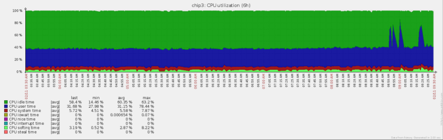

If you are interested in compiling the latest version of OpenCV for the [CHIP](https://getchip.com/pages/chip) SoC then this project will show you how (it should work with some tweaks on other ARM platforms). You should be experienced with [flashing](https://docs.getchip.com/chip.html#flash-chip-with-an-os) your CHIP and formatting a USB flash drive as ext4. It also does not hurt to know Linux and OpenCV as well. I have created a set of scripts that automate the install process. I'm also including Python code to play with CV after OpenCV is installed.

This is intended for a headless server, but you can modify install-opencv.sh to use a GUI. You can see where I built OpenCV using QT [here](https://bbs.nextthing.co/t/opencv-3-2-using-hdmi-dip-for-face-detection-gui/13432). I used the HDMI DIP for the display.

If you want to make your own CHG-IN cables click [here](https://bbs.nextthing.co/t/powering-chip-off-chg-in-using-cheap-cables/14469).

* [Provides](#provides)
* [Low Cost CV Camera](#low-cost-cv-camera)
* [Requirements](#requirements)
* [WARNING](#warning)
* [Flash CHIP](#flash-chip)
* [Configure OS](#configure-os)
* [Test Camera](#test-camera)
* [Download project](#download-project)
* [Install The Whole Enchilada](#install-the-whole-enchilada)
* [Install Java and Ant](#install-java-and-ant)
* [Install libjpeg-turbo](#install-libjpeg-turbo)
* [Install mjpg-streamer](#install-mjpg-streamer)
    * [mjpg-streamer performance](#mjpg-streamer-performance)
* [Install OpenCV](#install-opencv)
* [Performance testing](#performance-testing)
* [Motion Detection](#motion-detection)
* [References](#references)
* [FreeBSD License](#freebsd-license)

###Provides
* Latest Oracle JDK 8 and Apache Ant
* Latest libjpeg-turbo optimized for Cortex-A8 and Neon
* Latest mjpg-streamer (10/27/2013 last commit) optimized with libjpeg-turbo
* Latest OpenCV with opencv_contrib optimized for libjpeg-turbo, Cortex-A8 and Neon
* CV examples in Python for the CHIP

###Low Cost CV Camera
I have made my own cameras for several years now, but the CHIPcam will be the least expensive so far. I ended up buying 10 CHIPS, so the shipping costs were spread over 5 units on each shipment. I would have just bought 10 if I knew they worked so well. The prices I give here are in US dollars, so you can expect to pay more or less depending on where you live.
* CHIP $9 + $1.85 shipping ($9.25 shipping for 5 units), say $12
* [10x 1M/3.3ft Black 22AWG USB A Male Plug 2 wire Power Cable Cord Connectors DIY](http://www.ebay.com/itm/321827926426) $7.59 / 10 = $0.76 (this will take a month or so from China)
* Dupont pins [2.54mm Dupont Jumper Wire Cable Male Pin Connector,100pcs](https://www.amazon.com/gp/product/B01GFTZEVY) $4.99 for 100, so $0.10 for 2 pins. You can find them cheaper elsewhere. Prime was easy and fast.
* 5V/2A PSU. Most of the 2A PSUs I get from Ebay do not come close to 2A. I'm going to give you $5 here and wish you luck.
* [32GB USB Memory Stick Yoosion 2-in-1](https://www.amazon.com/gp/product/B01CTVQZUQ) $10.99
* [Logitech C270 Webcam](https://www.amazon.com/gp/product/B004FHO5Y6) $18.99

Total cost: $47.84

You can pay more or less depending on the camera and flash drive. This is my first less than $50 CV camera I've built. If you were just to build a video streamer you can forego the flash drive saving another $11.

###Requirements
* CHIP
* USB 5V/2A PSU with micro USB cable or USB cable with Dupont pins for CHG-IN.
* USB flash drive formatted as ext4
* Internet connection
* USB camera (this is only if you wish to use a camera)
    * You will need a powered USB hub if you are powering off the OTG port
    * For CHG-IN you need an OTG flash drive or an adapter for OTG to USB
    * Some USB cameras like the Logitech C270 can use up to 500 mA. If your CHIP shuts down try a different PSU or cable. My shutdown issues were always caused by a shady PSU. I found a good PSU in my supply and use home made CHG-IN cables. It had no problems running 100% CPU with camera and flash drive plugged in directly recording video.

###WARNING
I used no-limit setting on CHIP to prevent power issues with OpenCV failing to compile at maximum CPU speed or with a USB drive attached. This setting could damage a laptop or PC USB port, so make sure you use a dedicated 5V/2A PSU to power off the OTG port.

###Flash CHIP
I used the [Headless 4.4](https://bbs.nextthing.co/t/chip-os-4-4-released-vga-hdmi-and-more/4319) since OpenCV compile and runtime can use quite a bit of memory. Plus all of my CV projects only require a headless server to run. After you flash your CHIP unplug everything and insert a ext4 formatted USB drive and the PSU. Boot up CHIP and ssh in (I had to ping the IP first in order for ssh to work).

* Set a static IP address
    * Activate wifi connection
         * `sudo nmtui`
    * Edit and make static address
         * `sudo nmtui`
    * Shutdown
         * `sudo shutdown now -h`

###Configure OS
* Assign hostname and IP
    * `sudo nano /etc/hostname`
    * `sudo nano /etc/hosts`
* No power limit (for OTG power only, read warning above)
    * `sudo systemctl enable no-limit`
    * `sudo reboot`
* Do updates
    * `sudo apt-get update`
    * `sudo apt-get upgrade`
* Configure locales and timezone
    * `sudo apt-get install locales`
    * `sudo dpkg-reconfigure locales`
    * `sudo dpkg-reconfigure tzdata`
* Auto mount USB drive
    * `sudo apt-get install usbmount`
    * `sudo nano /etc/usbmount/usbmount.conf`
         * Remove `sync` and `noexec` from MOUNTOPTIONS
    * `sudo reboot`
* Set USB drive owner
    * `sudo chown -R chip:chip /media/usb0`

###Test Camera
If you plan on processing only video or image files then you can skip this section. Live video will allow you to create smart camera applications that react to a live video stream (versus a streaming only camera). You will need to select a USB camera that works under [Linux](http://elinux.org/RPi_USB_Webcams) and has the proper resolution.

Make sure you plugged in your USB drive to the USB adapter and plug that into CHIP's OTG micro USB port (or use a OTG flash drive). The camera should be plugged into the full size USB port.
* Add chip user to video group
    * `sudo usermod -a -G video chip`
* Install uvcdynctrl v4l-utils
    * `sudo apt-get install uvcdynctrl v4l-utils`
* Reboot
    * `sudo reboot`
* Get camera information (using a cheap Kinobo Origami Webcam here for illustration)
    * `lsusb`
         * `Bus 003 Device 002: ID 1871:0142 Aveo Technology Corp.`
    * `uvcdynctrl -f`
         * `Pixel format: YUYV (YUYV 4:2:2; MIME type: video/x-raw-yuv)`

###Download project
* `sudo apt-get install git-core`
* `cd /media/usb0`
* `git clone --depth 1 https://github.com/sgjava/opencv-chip.git`

###Install The Whole Enchilada
This is probably the easiest way to install everything, but you can follow the individual steps below to build or rebuild individual components. There are values you can change in the individual scripts, so read them over. Skip the rest of the individual scripts below if you run this.
* `cd /media/usb0/opencv-chip/scripts`
* `sudo nohup ./install.sh &`
    * Use `top` to monitor until build completes
    * Runtime ~5 hours

###Install Java and Ant
* `cd /media/usb0/opencv-chip/scripts`
* `sudo ./install-java.sh`
    * Runtime ~2 minutes
* `java -version`
* `ant -version`

###Install libjpeg-turbo
Patches jdhuff.c to remove "Invalid SOS parameters for sequential JPEG" warning and jdmarker.c to remove "Corrupt JPEG data: xx extraneous bytes before marker 0xd9" warning. These will fill up the logs if not muted.
* `cd /media/usb0/opencv-chip/scripts`
* `sudo nohup ./install-libjpeg-turbo.sh &`
    * Use `top` to monitor until build completes
    * Runtime ~15 minutes

###Install mjpg-streamer
Sometimes all you need is a live video feed without further processing. This section will be what you are looking for. It also makes sense to move the UVC processing into a different Linux process or thread from the main CV code.

Change `whitepatch` in `install-mjpg-streamer.sh` to `True` if you get a white image. I had to set this to True for using MPJEG mode. In YUYV I set it to `False`. The default setting is `True`.

* `cd /media/usb0/opencv-chip/scripts`
* `sudo sh install-mjpg-streamer.sh`
    * Runtime ~3 minutes
* `v4l2-ctl --list-formats`
    * Check Pixel Format for 'YUYV' and/or 'MJPG'
* To run mjpg-streamer with 'YUYV' only camera use
    * `mjpg_streamer -i "/usr/local/lib/input_uvc.so -y" -o "/usr/local/lib/output_http.so -w /usr/local/www"`
* To run mjpg-streamer with 'MJPG' use
    * `mjpg_streamer -i "/usr/local/lib/input_uvc.so" -o "/usr/local/lib/output_http.so -w /usr/local/www"`
* In your web browser or VLC player goto `http://yourhost:8080/?action=stream` and you should see the video stream.

####mjpg-streamer performance
The bottom line is you need an MJPEG USB camera because CPU usage is too high using YUYV. CHIP only has one core, so you want to use a little CPU as possible acquiring the frames. If you plan on streaming only then this might not be a big deal, but CV is CPU intensive. I used a Logitech C270 for the following tests:

YUYV 640x480 5 FPS
* `mjpg_streamer -i "/usr/local/lib/input_uvc.so -y -n -f 5 -r 640x480" -o "/usr/local/lib/output_http.so -w /usr/local/www"`
* CPU 36%
* Bitrate 675 kb/s

MJPG 640x480 5 FPS
* `mjpg_streamer -i "/usr/local/lib/input_uvc.so -n -f 5 -r 640x480" -o "/usr/local/lib/output_http.so -w /usr/local/www"`
* CPU < 1%
* Bitrate 503 kb/s

MJPG 1280x720 5 FPS
* `mjpg_streamer -i "/usr/local/lib/input_uvc.so -n -f 5 -r 640x480" -o "/usr/local/lib/output_http.so -w /usr/local/www"`
* CPU < 1%
* Bitrate 1689 kb/s

###Install OpenCV
I have included a Java patch that is disabled by default. The patch will fix memory leaks and performance issues with Java. See [OpenCV Java memory management](https://github.com/sgjava/opencvmem) for details.
* `cd /media/usb0/opencv-chip/scripts`
* `sudo rm nohup.out`
* `sudo nohup ./install-opencv.sh &`
    * Use `top` to monitor until build completes
    * Runtime ~4.5 hours

###Performance testing
I have included some Python code that will enable you to test various performance aspects of your camera. The goal is to see which methods are the most efficient and accurate. As a baseline we acquire a frame and convert it to a Numpy array. This is the format OpevCV utilizes for optimal performance. A Logitech C270 was used for testing.

OpenCV's VideoCapture at 640x480. VideoCapture returns less than 50% of the actual frame rate.

| ~CPU % | Target FPS | Actual FPS |
|--------|:----------:|-----------:|
|      8 |          5 |        2.3 |
|     13 |         10 |        4.5 |
|     18 |         15 |        6.9 |
|     24 |         20 |        9.1 |
|     29 |         25 |       11.2 |
|     36 |         30 |       13.7 |

To run example yourself use (this is 5 FPS example):
* `cd /media/usb0/opencv-chip/python/codeferm`
* `python CameraFpsCv.py -1 200 640 480 5`

OpenCV's VideoCapture and mjpg-streamer at 640x480. VideoCapture returns less than 66% of the actual frame rate.

| ~CPU % | Target FPS | Actual FPS |
|--------|:----------:|-----------:|
|     10 |          5 |        3.6 |
|     19 |         10 |        7.3 |
|     28 |         15 |        9.5 |
|     37 |         20 |       12.6 |
|     45 |         25 |       14.8 |
|     50 |         30 |       17.7 |

To run example yourself use (this is 5 FPS example):
* `cd /media/usb0/opencv-chip/python/codeferm`
* `mjpg_streamer -i "/usr/local/lib/input_uvc.so -n -f 5 -r 640x480" -o "/usr/local/lib/output_http.so -w /usr/local/www"`
* `python CameraFpsCv.py http://localhost:8080/?action=stream?dummy=param.mjpg 200 640 480 5`

My `mjpegclient` module and mjpg-streamer at 640x480. `mjpegclient` returns almost 100% of the actual frame rate!

| ~CPU % | Target FPS | Actual FPS |
|--------|:----------:|-----------:|
|     14 |          5 |        5.0 |
|     29 |         10 |        9.9 |
|     40 |         15 |       14.9 |
|     49 |         20 |       20.0 |
|     59 |         25 |       24.9 |
|     62 |         30 |       29.8 |

To run example yourself use (this is 5 FPS example):
* `cd /media/usb0/opencv-chip/python/codeferm`
* `mjpg_streamer -i "/usr/local/lib/input_uvc.so -n -f 5 -r 640x480" -o "/usr/local/lib/output_http.so -w /usr/local/www"`
* `python CameraFpsMjpeg.py http://localhost:8080/?action=stream?dummy=param.mjpg 200`

The actual CPU% per frame processed is about the same for each method with `mjpegclient` being a little more efficient. If driving the camera near actual FPS is important then `mjpegclient` is one solution.

Now we will look at writing a video from the camera. This will be the base line for CV processing. The more CPU we spend on decoding and encoding the less CPU there is for CV operations. This will form the basis for most CV projects analyzing frames from a camera, deciding what triggers a recording and finally doing something with that information. I'll skip X264 since it would only record about 2.5 FPS @ 640x480.

XVID actually made smaller files than X264 and was much more efficient. 

| ~CPU % | Target FPS | Actual FPS |
|--------|:----------:|-----------:|
|     43 |          5 |        5.0 |
|     72 |         10 |        9.9 |
|     95 |         15 |       14.9 |

To run example yourself use (this is 5 FPS example):
* `cd /media/usb0/opencv-chip/python/codeferm`
* `mjpg_streamer -i "/usr/local/lib/input_uvc.so -n -f 5 -r 640x480" -o "/usr/local/lib/output_http.so -w /usr/local/www"`
* `python CameraWriter.py http://localhost:8080/?action=stream 200 XVID 5 video-xvid.avi`

OpenCV uses FOURCC to set the codec for VideoWriter. Some are more CPU intensive than others, so plan to use a codec that is realistic on the platform you are running on. Since there's currently no way to utilize GPU/VPU acceleration on the CHIP with OpenCV you must rely on the general CPU.

###Motion Detection

This is the first example into the foray that is Computer Vision. This is also a practical example that you can use as the basis for other CV projects. From experience I can tell you that you need to understand the usage scenario. Simple motion detection will work well with static backgrounds, but using it outside you have to deal with cars, tree branches blowing, sudden light changes, etc. This is why built in motion detection is mostly useless on most security cameras. You can use ignore bitmaps and ROIs (regions of interest) to improve results with dynamic backgrounds. For instance, I can ignore my palm tree, but trigger motion if you walk in my doorway.

For starters we will do basic moving average based detection. It will return ROIs that can be used in further processing. MotionDetect.py can mark the motion ROIs before writing to video. You can use this for debugging and fine tuning. I ran a 14 hour test with MotionDetect.py (with pedestrian detection) and it stayed rock solid at 10 FPS while using < 40% CPU when idle and 90% peaks when doing pedestrian detection and recording according to Zabbix. This time we will run mjpg-streamer in background. Using `-b` did not work for me as `chip` user, so I used `nohup`. Eventually mjpg-streamer will become a service, but this works for testing.

To run example yourself use (this is 5 FPS example):
* `cd /media/usb0/opencv-chip/python/codeferm`
* `nohup mjpg_streamer -i "/usr/local/lib/input_uvc.so -n -f 5 -r 640x480" -o "/usr/local/lib/output_http.so -w /usr/local/www" &`
* `python MotionDetect.py http://localhost:8080/?action=stream 400 XVID 5 /media/usb0 m true`

To process a video file you have already recorded without marking (replace the file name):
* `python MotionDetect.py /media/usb0/motion/2017-02-10/19-32-48.avi 400 XVID 5 /media/usb0 m true`
* This is handy for debugging issues or fine tuning

Videos will record to /media/usb0/motion using the date to build the directory and name time for file name. You can increase the frames parameter to something really large (216000 is 12 hours at 5 FPS) and run using `nohup`. This is what I will do for long term testing and burn in.

###References
* [openCV 3.1.0 optimized for Raspberry Pi, with libjpeg-turbo 1.5.0 and NEON SIMD support](http://hopkinsdev.blogspot.com/2016/06/opencv-310-optimized-for-raspberry-pi.html)
* [script for easy build opencv for raspberry pi 2/3, beaglebone, cubietruck, banana pi and odroid c2 ](https://gist.github.com/lhelontra/e4357758e4d533bd415678bf11942c0a)
* [conflicting switches: -march=armv7-a -mcpu=cortex-a8 ](https://bugs.launchpad.net/gcc-linaro/+bug/662720)
* [How to build libjpeg-turbo with Neon(SIMP) on odroid with linux environment](http://stackoverflow.com/questions/41979004/how-to-build-libjpeg-turbo-with-neonsimp-on-odroid-with-linux-environment)

###FreeBSD License
Copyright (c) Steven P. Goldsmith

All rights reserved.

Redistribution and use in source and binary forms, with or without modification, are permitted provided that the following conditions are met:
* Redistributions of source code must retain the above copyright notice, this list of conditions and the following disclaimer.
* Redistributions in binary form must reproduce the above copyright notice, this list of conditions and the following disclaimer in the documentation and/or other materials provided with the distribution.

THIS SOFTWARE IS PROVIDED BY THE COPYRIGHT HOLDERS AND CONTRIBUTORS "AS IS" AND ANY EXPRESS OR IMPLIED WARRANTIES, INCLUDING, BUT NOT LIMITED TO, THE IMPLIED WARRANTIES OF MERCHANTABILITY AND FITNESS FOR A PARTICULAR PURPOSE ARE DISCLAIMED. IN NO EVENT SHALL THE COPYRIGHT HOLDER OR CONTRIBUTORS BE LIABLE FOR ANY DIRECT, INDIRECT, INCIDENTAL, SPECIAL, EXEMPLARY, OR CONSEQUENTIAL DAMAGES (INCLUDING, BUT NOT LIMITED TO, PROCUREMENT OF SUBSTITUTE GOODS OR SERVICES; LOSS OF USE, DATA, OR PROFITS; OR BUSINESS INTERRUPTION) HOWEVER CAUSED AND ON ANY THEORY OF LIABILITY, WHETHER IN CONTRACT, STRICT LIABILITY, OR TORT (INCLUDING NEGLIGENCE OR OTHERWISE) ARISING IN ANY WAY OUT OF THE USE OF THIS SOFTWARE, EVEN IF ADVISED OF THE POSSIBILITY OF SUCH DAMAGE.
